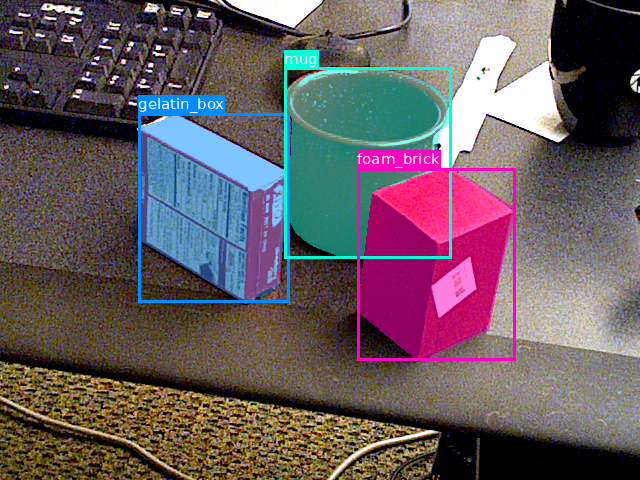

## Introduction
This code transforms segmentation mask images to annotation JSON files as per the MS COCO format http://cocodataset.org/#format-data

Use the implementation from [image-to-coco-json-converter](https://github.com/chrise96/image-to-coco-json-converter) and [COCO Viewer](https://github.com/trsvchn/coco-viewer)

## Dataset used: YCB-Video

## Visual result in YCB-Video

|  |
|:---:|
